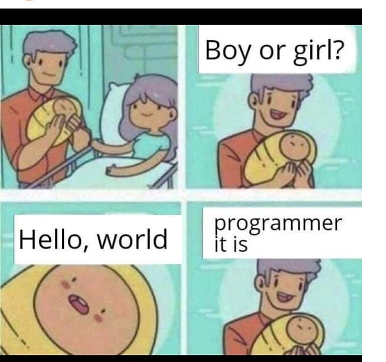

# DSSA Data Gathering & Warehousing

**Instructor**: Carl Chatterton <br>
**Term**: Fall 2022 <br>
**Module**: 1 <br>
**Week**: 2 <br>

---

### What is computer programming?


**Computer Programming** is a way to give computers instructions to complete a task. 

A **Program** is a set of instructions that tell a computer what to do. A program is created using a programming language.

A **Programming Language** is a language that can be used to communicate with computers.  

Programmers (or Developers) use programming languages to communicate with machines to create or do something: 
> Examples of computer programs:
> - A simple website
> - Generate images or digital artwork
> - Building Blockchain or Cryptocurrencies
> - Software for analytics
> - Classify images of cats

#### How do programming languages work?

Machines rely on binary code to execute a set of instructions. Typically, a programmer writes instructions in a higher level language which is converted to binary using a compiler. Sometimes there is an additional step called **linking** which combines the programmers instructions with libraries of instructions created by someone else. 

When a program is executed, the operating system opens the program, reads the binary instructions and executes the tasks. 

*The exact steps taken by each programming language to covert high level source code into an executable program may vary, but in general, will follow some form of this process*

**Binary Code** is a numeric coding made up of only 1s and 0s. 


#### What are Interpreters?

**Interpreted Languages** depends on an interpreter program that reads high level code and translates it <u>on execution</u> into machine code. Since, the code is interpreted at execution it needs to be re-interpreted each time the code is executed.

#### What are P-coded languages?
Since the 1990s, several hybrid languages have emerged that use both compilation and interpretation. A P-coded language compiles high level code into a compact binary form (but is not machine code). This pseudo code (p-code) is then interpreted at execution.

P-code languages include `Python Perl and Java`


---

### Introduction to Python Programming Language
```python
# Using python, print Hello, world! as the output back to the console
>>> print("Hello, world!")
Hello, world!
```
Congratulations you have just written and executed a line of python!

**Exercise:** Should only take 1-2 minutes...
1. Explore and experiment with the interpreter. Try printing other words.
2. Can you make Errors appear (it shouldn’t be too difficult)? How many different ones can you make? Make a list and google each one.
 
---
### Python Basics

#### Syntax in Python
**Indentation** refers to the amount of spacing at the beginning of a code line. Python uses indentation to indicate a block of code.

Example of correct indentation
```python
if 5 > 2:
  print("Five is greater than two!")
```

Example of bad indentation (returns a syntax error)
```python
if 5 > 2:
print("Five is greater than two!")
```

**Comments** provide us a way to document our code using `#` or `"""`. Python will ignore comments
```python
# This is a comment
>>> print("Hello, World!")
```
**Variables** are containers for storing values. Python has no command for declaring a variable and is created the moment you assign a value to it. 

A variable can have a short name (like x and y) or a more descriptive name (age, classname, total_amount). 
> Rules for Python variables:
    1. A variable name must start with a letter or the underscore character
    2. A variable name cannot start with a number
    3. A variable name can only contain alpha-numeric characters and underscores (A-z, 0-9, and _ )

Variable names are case-sensitive (age, Age and AGE are three different variables)

Example of variables:
```python
x = 5
y = "John"
print(x)
print(y)
```

Other examples:
```python
# String variables can be single or double quoted
x = "John"
# is the same as
x = 'John'

# Variables are case sensitive
a = 4
A = "Sally" #A will not overwrite a
```

Multi-word variables follow 3 patterns in python:
```python
# Camel Case - each work starts with capital letter, except the first
someVariableName = "Hello"

# Pascal Case - each work starts with a capital letter
SomeVariableName = "Hello"

# Snake Case - Each word is separated by an underscore character
some_variable_name = "Hello"
```
**Exercise:** Should only take 1-2 minutes...
1. Make some variables that contain numbers and strings
2. Make some multi-word variables

Following are the standard or built-in data type of Python: 
  


#### Numbers in Python
In Python, numeric data types represent the data which has numeric value. Numeric data can be an integer `int()`, floating number `float()` or complex numbers `complex()`.  

**Integers** – This value is represented by int class. It contains positive or negative whole numbers (without fraction or decimal). In Python there is no limit to how long an integer value can be.
```python
>>> 45 # This is an integer
45

>>> 45 + 3 # We can do arithmetic with integers 
48

>>> num = 10 # We can assign a integer to a variable
>>> print("Type of num: ", type(num)) 
Type of num:  <class 'int'>
```

**Float** – This value is represented by float class. It is a real number with floating point representation. It is specified by a decimal point. Optionally, the character `e` followed by a positive or negative integer may be appended to specify scientific notation. 
```python
>>> 25.0 # this is a float

>>> float("1.25") # We can covert strings to float
1.25

>>> 1e-4 # we can use e to specify scientific notation
0.0001

>>> 3 + 1.5 # adding an integer to a float returns a float
4.5

>>> 1.2 - 1.0 # Careful of floating point error
0.199999999999999996
```

**Complex Numbers** – Complex number is represented by complex class. It is specified as (real part) + (imaginary part)j. For example – 2+3j 

>Imagine an electronic piano. Each key produces a different tone. A volume control changes the amplitude (volume) of all the keys by the same amount. That's how real numbers affect signals.
>
>Now, imagine a filter. It makes some keys sound louder and some keys sound softer, depending on their frequencies. That's complex numbers -- they allow an "extra dimension" of calculation.

This link provides an in-depth review of [Complex numbers](https://www.scienceuse.com/the-complex-numbers-in-real-life/) if you need a refresher. In data science, you will come across many complex numbers, for example, Fourier Transformations used in signal processing
```python
>>> x = 3+4j 

>>> print(x.real) # the real part 
3.0

>>> print(x.imag) # the imaginary part
4.0
```
**Exercise:** Should only take 1-2 minutes...
1. Do some basic math operations in python
2. Try to do addition `+`, subtraction `-`, multiplication `*`, and division `/`

#### Text in Python

In Python, text data types represent the data which has text values. Text data is represented as a `str()` type in python. 
```python
>>> "hi" # using ""s or '' denote a string type
hi

>>> type('hi') # confirm type
str

>>> int('3') # we can convert other data types to str
3

>>> str(3)  # note the ''s that indicate a str object
'3'       

>>> msg = "Hello, " + "World" # Concatenating two strings
>>> print(msg)
'Hello, World'

```
#### Conditionals in Python
Conditional flow control is how the python interpreter chooses which code to execute. Think of it as how to express choices.

**Boolean** expressions are lines of code that resolve to a boolean object. There are only two values a boolean object can take: True or False.

Conditionals always base their decisions on the result of a boolean expression. They are always followed by a block of code.

**if, elif, else** statements allow our code to make choices based on a condition. `if`,`elif`, and `else` statements use operators for control flow of code:
> Operators:
    - equality: `==`
    - greater than: `>=`
    - less than: `<=`
    - not equal: `!=`

Examples: `if else` 
- The condition evaluated as a Boolean, it can either be True or False.
- Contains one more lines of code. Each of those lines must indented (use the tab button).
```Python
a = 4
if a == 4: 
    print('This code block will execute')
else:
    print('This code block will not execute')

```
Examples: `if elif else`
```Python
a = "hello, world"
if a == "star wars": 
    print('This code block will not execute')
elif a == "hello, world":
    print('This code block will execute')
else:
    print('This code block will not execute')
```
Conditionals test the equality of two objects to return `True` or `False`. Additionally, objects must also be the same data type to be considered equal
```python
>>> '5' == '5' # strings are exactly equal
True
>>> '5' == '6' # strings are not exact equal
False
>>> 5 == '5' # float and strings are not equal
False
```
**Exercise:** Should only take 1-2 minutes...
1. Write a short **if/else statement** comparing a numeric condition
2. Write an **if/elif/else statement** comparing strings
 
#### While and For Loops in Python
What are loops? A loop allows us to execute a block of code a number of times. A statement or a group of statements can be executed multiple times using loops. Generally, we have to execute the statements sequentially. Hence, the first statement is executed first and the last one is executed last.

##### While Loops
The `while` loop construct is a way of instructing the interpreter to repeat indefinitely. The condition defines when the loop will terminate.


How to construct:
```python
while <condition>:   # condition must evaluate to a boolean
    <code block>     # the indent defines the loop's code block
```

A basic example:
```python
i = 1 # initialize a integer

# The while loop runs indefinitely until the condition is met
while i < 6:
    print(i)
    i += 1 # i is increased with each loop
```

##### For Loops
A `for` loop is used for iterating over a sequence type (lists, tuples, dictionaries, or sets). With `for` loops we can execute statements for each item. 


```python
# For Loop for a list
fruits = ["apple", "banana", "cherry"]
for x in fruits:
    print(x)

for x in "banana":
    print(x)
```
##### Break & Continue Statements
The **break** statement allows us to stop the loop before it has iterated through all items
```python
fruits = ["apple", "banana", "cherry"]
for x in fruits:
    print(x)
    if x == "banana":
        break
```
The **continue** statements allows us to stop the current iteration of the loop, and continue with the next:
```python
fruits = ["apple", "banana", "cherry"]
for x in fruits:
    if x == "banana":
        continue
    print(x)
```
---
### What is Object Oriented Programming (OOP)?

**Object-oriented Programming** is a programming paradigm based on the concept of "objects" which can contain data and code:
- Data, in the form of fields or properties (known as attributes)
- Code, in the form of procedures or behaviors (known as methods)


There are four pillars to OOP:
- **Inheritance:** allows classes to inherit attributes and methods from the parent class
- **Encapsulation:** contains information in an object, exposes only select information
- **Abstraction:** only exposing high level public methods for accessing an object
- **Polymorphism:** many methods can do the same task

**Inheritance** allows classes to inherit features of other classes. In other words, a parent class can extend attributes and methods to a child class. 

Examples of Inheritance using Python:
```python
from datetime import datetime, timedelta


# Parent Class
class Vehicle:

    def __init__(self, vin, manuf_date):
        # Initializes attributes of the Vehicle class
        self.vin = vin
        self.manuf_date = manuf_date

    def get_age(self):
        # creates a datetime object with the current datetime
        current_time = datetime.now()
        # returns timedelta object
        age = current_time - self.manuf_date
        # returns age of the vehicle as a timedelta object
        return age

# Child Class
class Tesla(Vehicle):
        
    def __init__(self, vin, manuf_date, battery_type, battery_lifetime):
        # super() allows us to access parent class methods directly 
        super().__init__(vin, manuf_date)
        # initializes Tesla specific attributes
        self.battery_type = battery_type
        self.battery_lifetime = battery_lifetime
    
    def replace_battery_indicator(self): 
        # Calculate the vehicles age by accessing the parent Vehicle class method called get_age
        age = Vehicle.get_age(self)
        # determine the age in years by converting the timedelta object to days / 365
        battery_age = (age.days / 365)
        # if statement to compare the current battery age to the battery shelf life
        if battery_age >= self.battery_lifetime:
            # True if the battery needs to be replaced
            indicator = True
        else:
            # False if it does not need to be replaced
            indicator = False
        # return the indicator status to the console
        print(indicator)
        
        
>>> model_s = Tesla(vin='123456', manuf_date=datetime(2019, 10, 1), battery_type='lithium', battery_lifetime=4)
>>> model_s.replace_battery_indicator()
False

>>> model_y = Tesla(vin='789101112', manuf_date=datetime(2009, 10, 1), battery_type='lithium', battery_lifetime=4)
>>> model_y.replace_battery_indicator()
True
```

**Encapsulation** gives us extra security by restricting access to certain methods and variables within a class. This prevents direct modification on data. In python, we denote private attributes within a class using underscore `_` as the prefix 

```python

class Computer:

    def __init__(self):
        # initialize the max price as an encapsulated attribute
        self._max_price = 900

    def get_selling_price(self):
        # prints the selling price of the computer to the console
        print("Selling Price: {}".format(self._max_price))

    def set_max_price(self, price):
        # method to change the encapsulated attribute value 
        self._max_price = price

>>> c = Computer()
>>> c.get_selling_price()
selling Price: 900

# Let see what happens when we try to change the price
>>> c._max_price = 1000
>>> c.get_selling_price()
Selling Price: 900

# using setMaxPrice Method
>>> c.set_max_price(1000)
>>> c.get_selling_price()
Selling Price: 1000

```

**Abstraction** allows the user to interact with only selected attributes and methods of a class. Abstraction allows us to use simple things to represent complexity and hides details from the user. More simply, abstraction is just an extension of encapsulation. 

> For example, you do not need to know how the engine works to drive your car. 
> A driver (or user) of the car only needs to know how to use things like the gas pedal, brake, steering wheel, and blinker.
> Engineering is hidden from the driver under the hood of the car and exposing that information to the drive would be a distraction.


```python
"""
In the example, there is an abstract class Payment that has an abstract method payment().
There is also a child class CreditCardPayment derived from Payment that implements the abstract method payment() as per their functionality.

As a user we are abstracted from that implementation when the object CreditCardPayment is created and invokes the payment() method"""
from abc import ABC, abstractmethod
class Payment(ABC):

  def print_slip(self, amount):
    print('Purchase of amount- ', amount)

  @abstractmethod
  def payment(self, amount):
    pass

class CreditCardPayment(Payment):
  def payment(self, amount):
    print('Credit card payment of- ', amount)

>>> obj = CreditCardPayment()

>>> obj.payment(100)
Credit card payment of-  100

>>> obj.print_slip(100)
Purchase of amount-  100

# isinstance is a function that returns True if the specified object is of the specified type
>>> print(isinstance(obj, Payment))
True

```

**Polymorphism** gives you the ability to represent objects of different types using a single interface. Python can implement polymorphism in a number of ways. Often they are already built-in. like the `+` operator.

Examples of Polymorphism using `+`:
```python
# can be used for arithmetic in python
>>> x = 1 + 2
>>> print(x)
3

# can be used for concatenating strings in python
>>> x = 'Hello ' + "Students"
>>> print(x)
Hello Students

# Can be used to extend lists in python
>>> x = [1, 2, 3] + ['four', 'five', 6]
>>> print(x)
[1, 2, 3, 'four', 'five', 6]
```
**Exercise:** Should only take 1-2 minutes...
1. Explore and experiment other built-in examples of polymorphism using `len()` in python for the lines of code below
```python
# Return the number of elements in a list
>>> l = [1, 2, 3, 4]
# Return the number of characters in a string
>>> s = 'Data Gathering Rocks!'
# Return the number of keys in a dictionary 
>>> d = {1:'Foo' , 2:'Bar', 3:'Green'}
```


