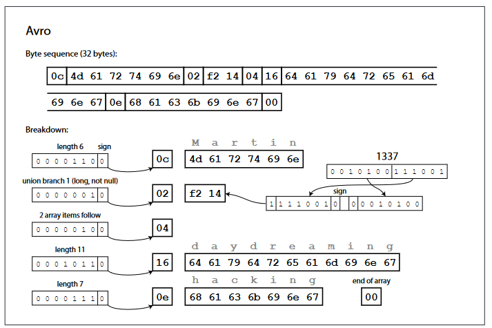
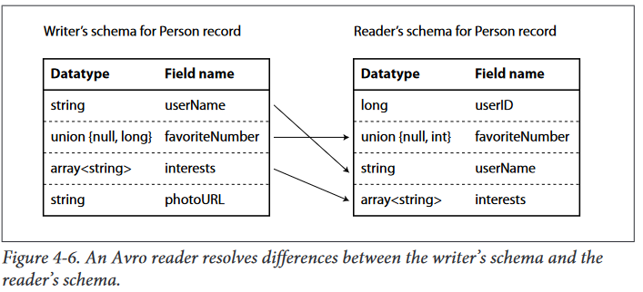
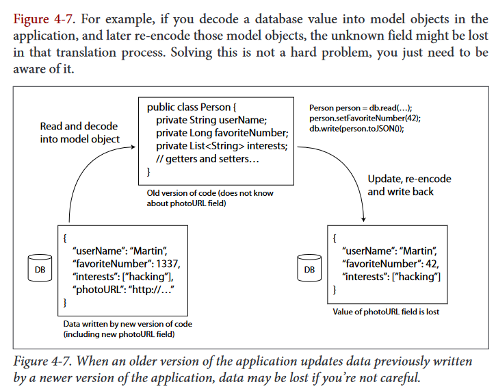

# DSSA Data Gathering & Warehousing
---

**Instructor**: Carl Chatterton 
**Term**: Fall 2022 
**Module**: 1 
**Week**: 2

---

---

## Encoding and evolution

Applications will change over time. As such, a change to an application's features also requires a change to data it stores.

Relational databases conforms to one schema although that schema can be changed, there is one schema enforced at any point in time. **Schema-on-read (or schema-less) contain a mixture of older and newer data formats.**

In server-side applications, changes or new features do not happen instantaneously. You want to perform a <u>_rolling upgrade_</u> and deploy a new version to a few nodes at a time, gradually working your way through all the nodes without service downtime.

Old and new versions of the code, and old and new data formats, may potentially all coexist. We need to maintain compatibility in both directions
*   __Backward compatibility__, newer code can read data that was written by older code.
* __Forward compatibility__, older code can read data that was written by newer code.

---

### Formats for encoding data

Programs work with (usually) one or two different representations of data:
* In-Memory Data Structures: data is kept in data structure objects like structs, list, dictionaries, maps, or trees. In this format, data structures are optimized for efficient access and manipulation by the CPU.
* Bytes sequences: When you want to write data to a file or send it over the network, you have to encode it as a sequence of bytes (For example, A JSON document)

Thus, we often need a translation layer between these two representations, called encoding.

__Encoding__: is the translation of in-memory objects a into byte sequence. (Serialization)
__Decoding__: is the translation of byte sequences to data structures kept in memory.


Programming languages come with built-in support for encoding in-memory objects into byte sequences, but is usually a bad idea to use them. Precisely because of a few problems.
* Often tied to a particular programming language.
* The decoding process needs to be able to instantiate arbitrary classes and this is frequently a security hole.
* Versioning
* Efficiency

Standardized encodings can be written and read by many programming languages.

JSON, XML, and CSV are human-readable and popular specially as data interchange formats, but they have some subtle problems:
* Ambiguity around the encoding of numbers and dealing with large numbers
* Support of Unicode character strings, but no support for binary strings. People get around this by encoding binary data as Base64, which increases the data size by 33%.
* There is optional schema support for both XML and JSON
* CSV does not have any schema

#### Binary encoding

JSON is less verbose than XML, but both still use a lot of space compared to binary formats. There are binary encodings for JSON (MesagePack, BSON, BJSON, UBJSON, BISON and Smile), similar thing for XML (WBXML and Fast Infoset).

__Verbose__: is the use of more characters than necessary to express something in code

**Apache Thrift and Protocol Buffers (protobuf) are binary encoding libraries.**

Thrift offers two different protocols:
* **BinaryProtocol**, there are no field names like `userName`, `favoriteNumber`. Instead the data contains _field tags_, which are numbers (`1`, `2`, `3`)

```json
// Example data we will use 
{
    "userName": "Martin",
    "favoriteNumber": 1337,
    "interests" : ["daydreaming", "hacking"]
}
```


* **CompactProtocol**, which is equivalent to BinaryProtocol but it packs the same information in less space. It packs the field type and the tag number into the same byte.


Protocol Buffers are very similar to Thrift's CompactProtocol, bit packing is a bit different and that might allow smaller compression.


Schemas inevitable need to change over time (_schema evolution_), how do Thrift and Protocol Buffers handle schema changes while keeping backward and forward compatibility changes?


* **Forward compatible support**. As with new fields you add new tag numbers, old code trying to read new code, it can simply ignore not recognized tags.
* **Backwards compatible support**. As long as each field has a unique tag number, new code can always read old data. Every field you add after initial deployment of schema must be optional or have a default value.

Removing fields is just like adding a field with backward and forward concerns reversed. You can only remove a field that is optional, and you can never use the same tag again.

What about changing the data type of a field? There is a risk that values will lose precision or get truncated. Example: 

- If we encode a 32-bit integer to 64-bit integer is safe because a parser can fill any missing bits with zeros
- However, if we decode a something stored as 64-bit integer to 32-bits we risk truncating any bits that do not fit.


---

## Apache Avro

Apache Avro is another binary format that has two schema languages, one intended for human editing (Avro IDL), and one (based on JSON) that is more easily machine-readable.

Avro-IDL example
```avro
record Person {
    string              userName;
    union {null, long}  favoriteNumber = null;
    array<string>       interest;
}
```
The equivalent in JSON representation
```json
{
    "type": "record",
    "name": "Person",
    "fields": [
        {
            "name": "userName",
            "type": "string"
        },
        {
            "name": "favoriteNumber",
            "type": ["null", "long"],
            "default": null
        },
        {
            "name": "interest",
            "type": {
                "type":"array",
                "items": "string"
            }
        },
    ]
}
```

You go go through the fields in the order they appear in the schema and use the schema to tell you the datatype of each field. Any mismatch in the schema between the reader and the writer would mean incorrectly decoded data.


__What about schema evolution?__ 
*   When an application wants to encode some data, it encodes the data using whatever version of the schema it knows (_writer's schema_).

*   When an application wants to decode some data, it is expecting the data to be in some schema (_reader's schema_).

In Avro the writer's schema and the reader's schema _don't have to be the same_. The Avro library resolves the differences by looking at the writer's schema and the reader's schema.



*   __Forward compatibility__ in Avro means you can have a new version of the schema as writer and an old version of the schema as reader. 
*   __Backward compatibility__ in Avro means that you can have a new version of the schema as reader and an old version as writer.

To maintain compatibility, you may only add or remove a field that has a default value.

*   If you were to add a field that has no default value, new readers wouldn't be able to read data written by old writers.

*   Changing the datatype of a field is possible, provided that Avro can convert the type. Changing the name of a filed is tricky (backward compatible but not forward compatible).

The schema is identified encoded in the data. In a large file with lots of records, the writer of the file can just include the schema at the beginning of the file. On a database with individually written records, you cannot assume all the records will have the same schema, so you have to include a version number at the beginning of every encoded record. While sending records over the network, you can negotiate the schema version on connection setup.

Avro is friendlier to _dynamically generated schemas_ (dumping into a file the database). You can easily generate an Avro schema in JSON.

If the database schema changes, you can just generate a new Avro schema for the updated database schema and export data in the new Avro schema.

By contrast with Thrift and Protocol Buffers, every time the database schema changes, you would have to manually update the mappings from database column names to field tags.

---

Although textual formats such as JSON, XML and CSV are widespread, binary encodings based on schemas are also a viable option. As they have nice properties:
* Can be much more compact, since they can omit field names from the encoded data.
* Schema is a valuable form of documentation, required for decoding, you can be sure it is up to date.
* Database of schemas allows you to check forward and backward compatibility changes.
* Generate code from the schema is useful, since it enables type checking at compile time.

---
## Modes of dataflow

So Far we have learned that...
*   <u>__We Encode Data to a sequence of bytes__</u> when we need to send data over a network or write data to a file. 
*   We need to understand the impacts of <u>__Forward & Backward compatibility__</u> in order to easily make changes or upgrade parts of a system independently. 
*   When define __Compatibility__ as the relationship between one process that __encodes__ the data, and another process that __decodes__ it.

If we think about these lesson so far, we can see how _abstract_ (having many ways of doing something) some data flows can be in an application.

#### Data Flows via databases

The process that writes to the database encodes the data, and the process that reads from the database decodes it.

A value in the database may be written by a _newer_ version of the code, and subsequently read by an _older_ version of the code that is still running.

When a new version of your application is deployed, you may entirely replace the old version with the new version within a few minutes. The same is not true in databases, the five-year-old data will still be there, in the original encoding, unless you have explicitly rewritten it. ___Data outlives code___.

Rewriting (_migrating_) is expensive, most relational databases allow simple schema changes, such as adding a new column with a `null` default value without rewriting existing data. When an old row is read, the database fills in `null`s for any columns that are missing.



#### Data Flows via web service calls

Web services are the latest incarnation of a long lineage of technologies for making API request over a network. 

They consist of processes that need to communicate over a network of _clients_ and _servers_.

Web services are similar to databases but not the same. Each service should be owned by a single team and that team should be able to release versions of that service frequently, without having to coordinate with other teams. We should expect old and new versions of servers and clients to be running at the same time.

We often refer to:
*   server-side processes as __backend__ processes
*   client-side processes as __frontend__ processes

__Remote procedure calls__ (RPC) is a type of protocol that tries to make a request to a remote network service look the same as calling a function or method in your programming language, it seems convenient at first but the approach is flawed:
* A network request is unpredictable
* A network request it may return without a result, due a _timeout_
* Retrying will cause the action to be performed multiple times, unless you build a mechanism for deduplication.
* A network request is much slower than a function call, and its latency is wildly variable.
* Parameters need to be encoded into a sequence of bytes that can be sent over the network and becomes problematic with larger objects.
* The RPC framework must translate datatypes from one language to another, not all languages have the same types.

**There is no point trying to make a remote service look too much like a local object in your programming language, because it's a fundamentally different thing.**

New generation of RPC frameworks are more explicit about the fact that a remote request is different from a local function call. Fiangle and Rest.li use _features_ (_promises_) to encapsulate asyncrhonous actions.

__RESTful API__ has some significant advantages like being good for experimentation and debugging. JSON is commonly used with RESTful APIs for requests/responses from a service.

REST seems to be the predominant style for public APIs nowadays. The main focus of RPC frameworks is on requests between services owned by the same organization, typically within the same data-center.

#### Data Flow via asynchronous message passing

*   In an _asynchronous message-passing_ systems, a client's request (usually called a _message_) is delivered to another process with low latency. 
*   The message is not sent via a direct network connection, but goes to an intermediary called a _message broker_ (_message queue_ or _message-oriented middleware_) 
*   __message brokers__ stores the message temporarily. This has several advantages compared to direct RPC:
    * It can act as a buffer if the recipient is unavailable or overloaded
    * It can automatically redeliver messages to a process that has crashed and prevent messages from being lost
    * It avoids the sender needing to know the IP address and port number of the recipient (useful in a cloud environment)
    * It allows one message to be sent to several recipients
    * **Decouples the sender from the recipient**

The communication happens only in one direction. The sender doesn't wait for the message to be delivered, but simply sends it and then forgets about it (___asynchronous___).

Open source implementations for message brokers are RabbitMQ, ActiveMQ, HornetQ, NATS, and Apache Kafka.

__How do message brokers work?__: One process sends a message to a named _queue_ or _topic_ and the broker ensures that the message is delivered to one or more _consumers_ or _subscribers_ to that queue or topic.

Message brokers typically don't enforce a particular data model, you can use any encoding format.

An _actor model_ is a programming model for concurrency in a single process. Rather than dealing with threads (and their complications), logic is encapsulated in _actors_. Each actor typically represent one client or entity, it may have some local state, and it communicates with other actors by sending and receiving asynchronous messages. Message deliver is not guaranteed. Since each actor processes only one message at a time, it doesn't need to worry about threads.

In _distributed actor frameworks_, this programming model is used to scale an application across multiple nodes. It basically integrates a message broker and the actor model into a single framework.

* _Akka_ uses Java's built-in serialization by default, which does not provide forward or backward compatibility. You can replace it with something like Protocol Buffers and the ability to do rolling upgrades.
* _Orleans_ by default uses custom data encoding format that does not support rolling upgrade deployments.
* In _Erlang OTP_ it is surprisingly hard to make changes to record schemas.

### Wrapping Up

We now understand...
* There are several ways of turning data structures into bytes
* Encoding/decoding data affects not only efficiency, but also the architecture of an application
* Servcie need support for rolling updates so new version can gradually be deployed without downtime. 
