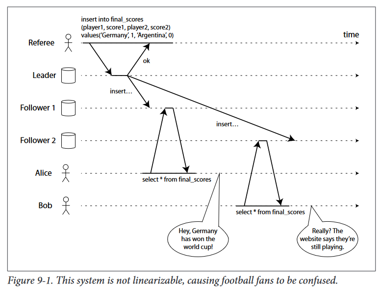

# DSSA Data Gathering & Warehousing
---

**Instructor**: Carl Chatterton 
**Term**: Fall 2022 
**Module**: 1 
**Week**: 8

---

---

## Consistency and Consensus

_"The simplest way of handling faults is to simply let the entire service fail."_

__Consistency guarantees:__ 
If you look at two database nodes at the same moment in time, you're likely to see different data because a write request can arrive on different nodes at different times. Most replicated databases provide at least _eventual consistency_.

__Eventual Consistency (or Convergence)__ means that if you stop writing to the database and wait for some unspecified length of time, then eventually all read requests will return the same value.

- When working with Database that have weak guarantees, you need to be constantly aware of its limitations. 
- Bugs may be subtle and hard to find in testing. Edge cases may only become apparent when there is a fault in the system (e.g. network interruption or higher degrees of concurrency)
- Systems with stronger guarantees may have worse performance or be less fault-tolerant than systems with weaker guarantees.

### Linearizability
_"In an eventually consistent database, if you ask two different replicas the same question at the same time, you may get two different answers. That's confusing."_

The idea behind _linearizability_ is to make a system appear as if there were only one copy of the data, and all operations on it are atomic.

In a linearizable system, as soon as one client successfully completes a write, all clients reading from the database must be able to see the value just written.

- `read(x) => v` : Read from register `x`, database returns value `v`.
- `write(x,v) => r` : `r` could be _ok_ or _error_.
  
If one client's read returns the new value, all subsequent reads must also return the new value.

`cas(x_old, v_old, v_new) => r` an atomic compare-and-set operation. If the value of the register x equals v_old, it is atomically set to v_new. If x != v_old the registers is unchanged and it returns an error.

__Serializability__: Transactions behave the same as if they had executed some serial order.

__Linearizability__: Recency guarantee on reads and writes of a register (individual object).

__Locking and leader election__
To ensure that there is indeed only one leader, a lock is used. It must be linearizable: all nodes must agree which nodes owns the lock; otherwise is useless.

Apache ZooKeeper and etcd are often used for distributed locks and leader election.

__Constraints and uniqueness guarantees__
Unique constraints, like a username or an email address require a situation similiar to a lock.

A hard uniqueness constraint in relational databases requires linearizability.

Implementing linearizable systems
The simplest approach would be to have a single copy of the data, but this would not be able to tolerate faults.

Single-leader repolication is potentially linearizable.
Consensus algorithms is linearizable.
Multi-leader replication is not linearizable.
Leaderless replication is probably not linearizable.
Multi-leader replication is often a good choice for multi-datacenter replication. On a network interruption betwen data-centers will force a choice between linearizability and availability.

With multi-leader configuraiton, each data center can operate normally with interruptions.

With single-leader replication, the leader must be in one of the datacenters. If the application requires linearizable reads and writes, the network interruption causes the application to become unavailable.

If your applicaiton requires linearizability, and some replicas are disconnected from the other replicas due to a network problem, the some replicas cannot process request while they are disconnected (unavailable).

If your application does not require, then it can be written in a way tha each replica can process requests independently, even if it is disconnected from other replicas (peg: multi-leader), becoming available.

If an application does not require linearizability it can be more tolerant of network problems.

The unhelpful CAP theorem
CAP is sometimes presented as Consistency, Availability, Partition tolerance: pick 2 out of 3. Or being said in another way either Consistency or Available when Partitioned.

CAP only considers one consistency model (linearizability) and one kind of fault (network partitions, or nodes that are alive but disconnected from each other). It doesn't say anything about network delays, dead nodes, or other trade-offs. CAP has been historically influential, but nowadays has little practical value for designing systems.

The main reason for dropping linearizability is performance, not fault tolerance. Linearizabilit is slow and this is true all the time, not on only during a network fault.

Ordering guarantees
Cause comes before the effect. Causal order in the system is what happened before what (causally consistent).

Total order allows any two elements to be compared. Peg, natural numbers are totally ordered.

Some cases one set is greater than another one.

Different consistency models:

Linearizablity. total order of operations: if the system behaves as if there is only a single copy of the data.
Causality. Two events are ordered if they are causally related. Causality defines a partial order, not a total one (incomparable if they are concurrent).
Linearizability is not the only way of preserving causality. Causal consistency is the strongest possible consistency model that does not slow down due to network delays, and remains available in the face of network failures.

You need to know which operation happened before.

In order to determine the causal ordering, the database needs to know which version of the data was read by the application. The version number from the prior operation is passed back to the database on a write.

We can create sequence numbers in a total order that is consistent with causality.

With a single-leader replication, the leader can simply increment a counter for each operation, and thus assign a monotonically increasing sequence number to each operation in the replication log.

If there is not a single leader (multi-leader or leaderless database):

Each node can generate its own independent set of sequence numbers. One node can generate only odd numbers and the other only even numbers.
Attach a timestamp from a time-of-day clock.
Preallocate blocks of sequence numbers.
The only problem is that the sequence numbers they generate are not consistent with causality. They do not correctly capture ordering of operations across different nodes.

There is simple method for generating sequence numbers that is consistent with causality: Lamport timestamps.

Each node has a unique identifier, and each node keeps a counter of the number of operations it has processed. The lamport timestamp is then simply a pair of (counter, node ID). It provides total order, as if you have two timestamps one with a greater counter value is the greater timestamp. If the counter values are the same, the one with greater node ID is the greater timestamp.

Every node and every client keeps track of the maximum counter value it has seen so far, and includes that maximum on every request. When a node receives a request of response with a maximum counter value greater than its own counter value, it inmediately increases its own counter to that maximum.

As long as the maximum counter value is carried along with every operation, this scheme ensure that the ordering from the lamport timestamp is consistent with causality.

Total order of oepration only emerges after you have collected all of the operations.

Total order broadcast:

Reliable delivery: If a message is delivered to one node, it is delivered to all nodes.
Totally ordered delivery: Mesages are delivered to every node in the same order.
ZooKeeper and etcd implement total order broadcast.

If every message represents a write to the database, and every replica processes the same writes in the same order, then the replcias will remain consistent with each other (state machine replication).

A node is not allowed to retroactgively insert a message into an earlier position in the order if subsequent messages have already been dlivered.

Another way of looking at total order broadcast is that it is a way of creating a log. Delivering a message is like appending to the log.

If you have total order broadcast, you can build linearizable storage on top of it.

Because log entries are delivered to all nodes in the same order, if therer are several concurrent writes, all nodes will agree on which one came first. Choosing the first of the conflicting writes as the winner and aborting later ones ensures that all nodes agree on whether a write was commited or aborted.

This procedure ensures linearizable writes, it doesn't guarantee linearizable reads.

To make reads linearizable:

You can sequence reads through the log by appending a message, reading the log, and performing the actual read when the message is delivered back to you (etcd works something like this).
Fetch the position of the latest log message in a linearizable way, you can query that position to be delivered to you, and then perform the read (idea behind ZooKeeper's sync()).
You can make your read from a replica that is synchronously updated on writes.
For every message you want to send through total order broadcast, you increment-and-get the linearizable integer and then attach the value you got from the register as a sequence number to the message. YOu can send the message to all nodes, and the recipients will deliver the message consecutively by sequence number.

Distributed transactions and consensus
Basically getting several nodes to agree on something.

There are situations in which it is important for nodes to agree:

Leader election: All nodes need to agree on which node is the leader.
Atomic commit: Get all nodes to agree on the outcome of the transacction, either they all abort or roll back.
Atomic commit and two-phase commit (2PC)
A transaction either succesfully commit, or abort. Atomicity prevents half-finished results.

On a single node, transaction commitment depends on the order in which data is writen to disk: first the data, then the commit record.

2PC uses a coordinartor (transaction manager). When the application is ready to commit, the coordinator begins phase 1: it sends a prepare request to each of the nodes, asking them whether are able to commit.

If all participants reply "yes", the coordinator sends out a commit request in phase 2, and the commit takes place.
If any of the participants replies "no", the coordinator sends an abort request to all nodes in phase 2.
When a participant votes "yes", it promises that it will definitely be able to commit later; and once the coordiantor decides, that decision is irrevocable. Those promises ensure the atomicity of 2PC.

If one of the participants or the network fails during 2PC (prepare requests fail or time out), the coordinator aborts the transaction. If any of the commit or abort request fail, the coordinator retries them indefinitely.

If the coordinator fails before sending the prepare requests, a participant can safely abort the transaction.

The only way 2PC can complete is by waiting for the coordinator to revover in case of failure. This is why the coordinator must write its commit or abort decision to a transaction log on disk before sending commit or abort requests to participants.

Three-phase commit
2PC is also called a blocking atomic commit protocol, as 2Pc can become stuck waiting for the coordinator to recover.

There is an alternative called three-phase commit (3PC) that requires a perfect failure detector.

Distributed transactions carry a heavy performance penalty due the disk forcing in 2PC required for crash recovery and additional network round-trips.

XA (X/Open XA for eXtended Architecture) is a standard for implementing two-phase commit across heterogeneous technologies. Supported by many traditional relational databases (PostgreSQL, MySQL, DB2, SQL Server, and Oracle) and message brokers (ActiveMQ, HornetQ, MSQMQ, and IBM MQ).

The problem with locking is that database transactions usually take a row-level exclusive lock on any rows they modify, to prevent dirty writes.

While those locks are held, no other transaction can modify those rows.

When a coordinator fails, orphaned in-doubt transactions do ocurr, and the only way out is for an administrator to manually decide whether to commit or roll back the transaction.

Fault-tolerant consensus
One or more nodes may propose values, and the consensus algorithm decides on those values.

Consensus algorithm must satisfy the following properties:

Uniform agreement: No two nodes decide differently.
Integrity: No node decides twice.
Validity: If a node decides the value v, then v was proposed by some node.
Termination: Every node that does not crash eventually decides some value.
If you don't care about fault tolerance, then satisfying the first three properties is easy: you can just hardcode one node to be the "dictator" and let that node make all of the decisions.

The termination property formalises the idea of fault tolerance. Even if some nodes fail, the other nodes must still reach a decision. Termination is a liveness property, whereas the other three are safety properties.

The best-known fault-tolerant consensus algorithms are Viewstamped Replication (VSR), Paxos, Raft and Zab.

Total order broadcast requires messages to be delivered exactly once, in the same order, to all nodes.

So total order broadcast is equivalent to repeated rounds of consensus:

Due to agreement property, all nodes decide to deliver the same messages in the same order.
Due to integrity, messages are not duplicated.
Due to validity, messages are not corrupted.
Due to termination, messages are not lost.
Single-leader replication and consensus
All of the consensus protocols dicussed so far internally use a leader, but they don't guarantee that the lader is unique. Protocols define an epoch number (ballot number in Paxos, view number in Viewstamped Replication, and term number in Raft). Within each epoch, the leader is unique.

Every time the current leader is thought to be dead, a vote is started among the nodes to elect a new leader. This election is given an incremented epoch number, and thus epoch numbers are totallly ordered and monotonically increasing. If there is a conflic, the leader with the higher epoch number prevails.

A node cannot trust its own judgement. It must collect votes from a quorum of nodes. For every decision that a leader wants to make, it must send the proposed value to the other nodes and wait for a quorum of nodes to respond in favor of the proposal.

There are two rounds of voting, once to choose a leader, and second time to vote on a leader's proposal. The quorums for those two votes must overlap.

The biggest difference with 2PC, is that 2PC requires a "yes" vote for every participant.

The benefits of consensus come at a cost. The process by which nodes vote on proposals before they are decided is kind of synchronous replication.

Consensus always require a strict majority to operate.

Most consensus algorithms assume a fixed set of nodes that participate in voting, which means that you can't just add or remove nodes in the cluster. Dynamic membership extensions are much less well understood than static membership algorithms.

Consensus systems rely on timeouts to detect failed nodes. In geographically distributed systems, it often happens that a node falsely believes the leader to have failed due to a network issue. This implies frequest leader elecctions resulting in terrible performance, spending more time choosing a leader than doing any useful work.

Membership and coordination services
ZooKeeper or etcd are often described as "distributed key-value stores" or "coordination and configuration services".

They are designed to hold small amounts of data that can fit entirely in memory, you wouldn't want to store all of your application's data here. Data is replicated across all the nodes using a fault-tolerant total order broadcast algorithm.

ZooKeeper is modeled after Google's Chubby lock service and it provides some useful features:

Linearizable atomic operations: Usuing an atomic compare-and-set operation, you can implement a lock.
Total ordering of operations: When some resource is protected by a lock or lease, you need a fencing token to prevent clients from conflicting with each other in the case of a process pause. The fencing token is some number that monotonically increases every time the lock is acquired.
Failure detection: Clients maintain a long-lived session on ZooKeeper servers. When a ZooKeeper node fails, the session remains active. When ZooKeeper declares the session to be dead all locks held are automatically released.
Change notifications: Not only can one client read locks and values, it can also watch them for changes.
ZooKeeper is super useful for distributed coordination.

ZooKeeper/Chubby model works well when you have several instances of a process or service, and one of them needs to be chosen as a leader or primary. If the leader fails, one of the other nodes should take over. This is useful for single-leader databases and for job schedulers and similar stateful systems.

ZooKeeper runs on a fixed number of nodes, and performs its majority votes among those nodes while supporting a potentially large number of clients.

The kind of data managed by ZooKeeper is quite slow-changing like "the node running on 10.1.1.23 is the leader for partition 7". It is not intended for storing the runtime state of the application. If application state needs to be replicated there are other tools (like Apache BookKeeper).

ZooKeeper, etcd, and Consul are also often used for service discovery, find out which IP address you need to connect to in order to reach a particular service. In cloud environments, it is common for virtual machines to continually come an go, you often don't know the IP addresses of your services ahead of time. Your services when they start up they register their network endpoints ina service registry, where they can then be found by other services.

ZooKeeper and friends can be seen as part of a long history of research into membership services, determining which nodes are currently active and live members of a cluster.